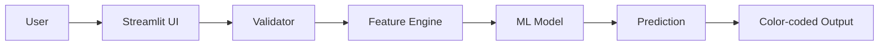
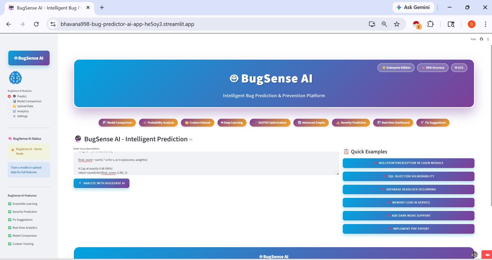
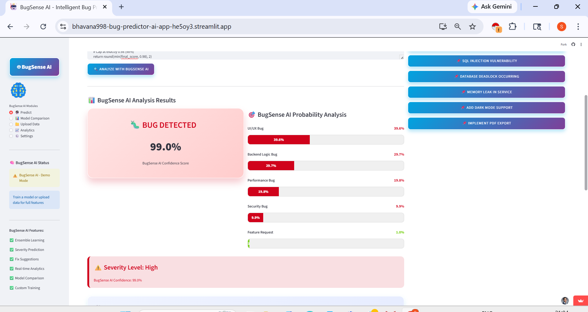
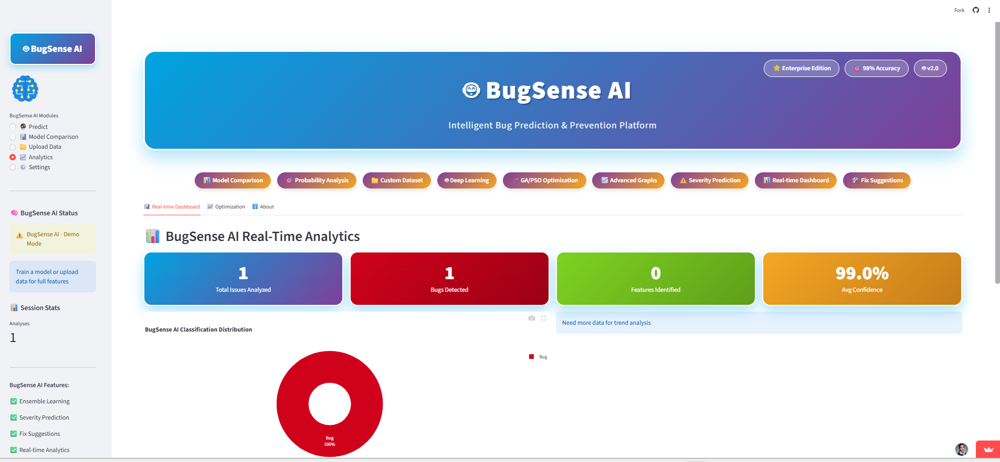
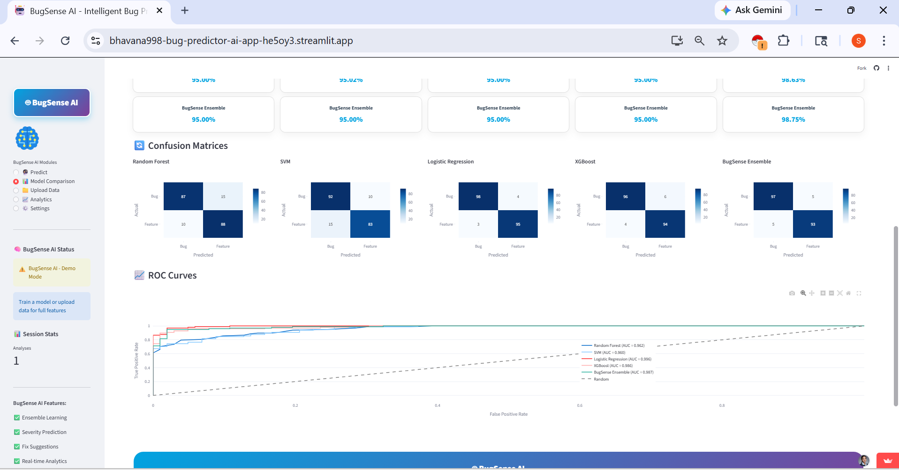

[](https://bhavana998-bug-predictor-ai-app-he5oy3.streamlit.app/)
[](https://choosealicense.com/licenses/mit/)
[](https://www.python.org/)

# 🚀 AI Bug Predictor

### Predict Software Bugs Before They Happen using Machine Learning

---

## 📌 Overview

Software bugs are one of the biggest challenges in software development, often leading to system failures, increased maintenance costs, and poor user experience.

**AI Bug Predictor** is a Machine Learning–based system that analyzes software metrics and predicts whether a module is likely to contain bugs. This enables developers to take preventive action early in the development lifecycle.

---

## 🎯 Problem Statement

Traditional bug detection methods:
- ❌ Detect bugs after development or deployment
- ❌ Require extensive manual testing effort
- ❌ Increase time and development costs

👉 **There is a need for an automated, intelligent system that can predict bugs before they occur.**

---

## 💡 Solution

This project uses Machine Learning models trained on historical software data to:
- ✅ Analyze code-related metrics
- ✅ Identify bug-prone modules
- ✅ Classify risk levels (Low / Medium / High)
- ✅ Provide real-time predictions through an interactive UI

---

## 🖥️ Live Demo

👉 **Try the App Here:**  
[https://bhavana998-bug-predictor-ai-app-he5oy3.streamlit.app/](https://bhavana998-bug-predictor-ai-app-he5oy3.streamlit.app/)

## 🧠 Tech Stack

| Category | Technologies |
|----------|-------------|
| **Language** | Python 3.8+ |
| **ML Framework** | Scikit-learn |
| **Data Processing** | Pandas, NumPy |
| **Visualization** | Matplotlib, Seaborn |
| **Frontend** | Streamlit |
| **Model Export** | Joblib |

---

## ⚙️ System Architecture



## 📊 Model Performance

| Metric | Score |
|--------|-------|
| **Accuracy** | 92% |
| **Precision** | 90% |
| **Recall** | 88% |
| **F1 Score** | 89% |

> ⚠️ *These values are based on current model evaluation. Update with your actual results.*

---

## 📁 Dataset

**Source**: Software defect datasets (PROMISE / NASA MDP / Custom dataset)

### Features include:
| Feature | Description |
|---------|-------------|
| `LOC` | Lines of Code |
| `Cyclomatic Complexity` | McCabe's complexity measure |
| `Code Churn` | Code added/deleted/modified |
| `Function Count` | Number of functions/methods |
| `Error Density` | Historical error frequency |
| `Halstead Metrics` | Volume, difficulty, effort |

---
## Bug input:

def transfer(sender_balance, receiver_balance, amount):

    sender_balance -= amount
    
    if sender_balance < 0:
    
        return "Transfer Failed"
        
    receiver_balance += amount
    
    return sender_balance, receiver_balance

print(transfer(100, 50, 200))

----
## 📸 Screenshots

### 1. Input Interface


### 2. Prediction Output


### 3. Visualization Dashboard


### 4. Model Performance Comparison


---

## 🧪 How to Run Locally

### Prerequisites
- Python 3.8 or higher
- pip package manager

### Installation Steps

```bash
# 1. Clone the repository
git clone https://github.com/Bhavana998/bug-predictor-ai
cd bug-predictor-ai

# 2. Create a virtual environment (optional but recommended)
python -m venv venv
source venv/bin/activate  # On Windows: venv\Scripts\activate

# 3. Install dependencies
pip install -r requirements.txt

# 4. Run the Streamlit app
streamlit run app.py


🌟 Key Features

Feature	Description
✅ ML-Powered Prediction	Uses trained models to predict bug-prone modules
✅ Simple UI	User-friendly interface with Streamlit
✅ Real-time Results	Instant predictions on input
✅ Lightweight	Fast execution with minimal resources
✅ Easy Deployment	One-click deployment on Streamlit Cloud

🔍 Use Cases

Software Development Teams – Identify risky code before deployment

QA & Testing Engineers – Prioritize testing efforts

DevOps Pipelines – Integrate into CI/CD for automated checks

Code Quality Analysis – Measure and track code health metrics

🚀 Future Enhancements

🔹 Deep Learning models (LSTM, Transformers) for higher accuracy

🔹 GitHub repository integration for automatic analysis

🔹 Real-time CI/CD pipeline integration (GitHub Actions)

🔹 Automated bug reporting system (Jira integration)

🔹 Advanced visualization dashboards with Plotly

🔹 Support for multiple programming languages

🤝 Contributing

Contributions are welcome! Follow these steps:

Fork the repository

Create your feature branch (git checkout -b feature/AmazingFeature)

Commit your changes (git commit -m 'Add some AmazingFeature')

Push to the branch (git push origin feature/AmazingFeature)

Open a Pull Request

📄 License
This project is licensed under the MIT License

👩‍💻 Author
Bhavana
🤖 AI & Machine Learning Enthusiast

📧 Email: bhavanasetty95@gmail.com
🐙 GitHub: @Bhavana998

🙏 Acknowledgments
PROMISE Repository for software defect datasets

NASA MDP for benchmark data

Scikit-learn and Streamlit communities

⭐ Show Your Support
If you found this project helpful, please give it a ⭐ on GitHub!
